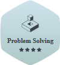
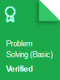

    

# Practice, Tutorials & Interview Preparation Solutions

## Personal HackerRank Profile

    

## HackerRank Badges

## HackerRank Certificates

### Table of Contents

* [10 Days of JavaScript](#10-days-of-javascript)
* [Challenges](#Challenges)

### Challenges

| Problem | Difficulty | Score | My Solution |
| :-------: | :------: | :---: |:-----------: |
| [Angry Professor](https://www.hackerrank.com/challenges/angry-professor/problem)| Easy | 20 | [Solution](https://github.com/saschaki/hackerRank/blob/master/problem-solving/implementation/angry-professor.js) |
|[Beautyful Days at the Movies](https://www.hackerrank.com/challenges/beautiful-days-at-the-movies/problem) |Easy | 15| [Solution](https://github.com/saschaki/hackerRank/blob/master/problem-solving/implementation/beautyful-days-at-the-movies.js)|
| [Circular Array Rotation](https://www.hackerrank.com/challenges/circular-array-rotation/problem) |Easy | 20 |[Solution](https://github.com/saschaki/hackerRank/blob/master/problem-solving/implementation/circular-array-rotation.js) |
[Minimum Distances](https://www.hackerrank.com/challenges/minimum-distances/problem) |Easy | 20 | [Solution](https://github.com/saschaki/hackerRank/blob/master/problem-solving/implementation/minimum-distances.js) |
|[Save the Prisoner!](https://www.hackerrank.com/challenges/save-the-prisoner/problem)  |Easy | 15 | [Solution](https://github.com/saschaki/hackerRank/blob/master/problem-solving/implementation/save-the-prisoner.js)|
|[Designer PDF Viewer](https://www.hackerrank.com/challenges/designer-pdf-viewer/problem)  |Easy | 20| [Solution](https://github.com/saschaki/hackerRank/blob/master/problem-solving/implementation/designer-pdf-viewer.js)|
|[Equalize the Array](https://www.hackerrank.com/challenges/equality-in-a-array/problem)  |Easy | 20| [Solution](https://github.com/saschaki/hackerRank/blob/master/problem-solving/implementation/equalize-the-array.js)|
|[The Hurdle Race](https://www.hackerrank.com/challenges/the-hurdle-race/problem) |Easy | 15 | [Solution](https://github.com/saschaki/hackerRank/blob/master/problem-solving/implementation/the-hurdle-race.js)|
|[Utopian Tree](https://www.hackerrank.com/challenges/utopian-tree/problem) |Easy | 20 | [Solution](https://github.com/saschaki/hackerRank/blob/master/problem-solving/implementation/utopian-tree.js)|
|[Viral Advertising](https://www.hackerrank.com/challenges/strange-advertising/problem)  |Easy | 15 | [Solution](https://github.com/saschaki/hackerRank/blob/master/problem-solving/implementation/viral-advertising.js)|
|[Big Sorting](https://www.hackerrank.com/challenges/big-sorting/problem)  |Easy | 20| [Solution](https://github.com/saschaki/hackerRank/blob/master/problem-solving/sorting/big-sorting.js)|
|[Camel Case](https://www.hackerrank.com/challenges/camelcase/problem)  |Easy | 15| [Solution](https://github.com/saschaki/hackerRank/blob/master/problem-solving/strings/camelCase.js)|
|[Funny String](https://www.hackerrank.com/challenges/funny-string/problem)  |Easy | 25| [Solution](https://github.com/saschaki/hackerRank/blob/master/problem-solving/strings/funny-string.js)|
|[HackerRank in a String](https://www.hackerrank.com/challenges/hackerrank-in-a-string/problem)  |Easy | 20| [Solution](https://github.com/saschaki/hackerRank/blob/master/problem-solving/strings/hackerRank-in-a-string.js)|
|[Mars Exploration](https://www.hackerrank.com/challenges/mars-exploration/problem)  |Easy | 15| [Solution](https://github.com/saschaki/hackerRank/blob/master/problem-solving/strings/mars-exploration.js)|
|[Pangrams](https://www.hackerrank.com/challenges/pangrams/problem)  |Easy | 20| [Solution](https://github.com/saschaki/hackerRank/blob/master/problem-solving/strings/pangrams.js)|
|[Strong Password](https://www.hackerrank.com/challenges/strong-password/problem)  |Easy | 15| [Solution](https://github.com/saschaki/hackerRank/blob/master/problem-solving/strings/strong-password.js)|
|[A very big sum](https://www.hackerrank.com/challenges/a-very-big-sum/problem)  |Easy | 10| [Solution](https://github.com/saschaki/hackerRank/blob/master/problem-solving/warmup/a-very-big-sum.js)|
|[Apple and Orange](https://www.hackerrank.com/challenges/apple-and-orange/problem)  |Easy | 10 | [Solution](https://github.com/saschaki/hackerRank/blob/master/problem-solving/warmup/apple-and-orange.js)|
|[Between two Sets](https://www.hackerrank.com/challenges/between-two-sets/problem)  |Easy | 10 | [Solution](https://github.com/saschaki/hackerRank/blob/master/problem-solving/warmup/between-two-sets.js)|
|[Birthday Cake Candles](https://www.hackerrank.com/challenges/birthday-cake-candles/problem)  |Easy | 10| [Solution](https://github.com/saschaki/hackerRank/blob/master/problem-solving/warmup/birthday-cake-candles.js)|
|[Birthday chocolate](https://www.hackerrank.com/challenges/the-birthday-bar/problem) |Easy | 10 | [Solution](https://github.com/saschaki/hackerRank/blob/master/problem-solving/warmup/birthday-chocolate.js)|
|[Bon appetit](https://www.hackerrank.com/challenges/bon-appetit/problem) |Easy | 10 | [Solution](https://github.com/saschaki/hackerRank/blob/master/problem-solving/warmup/bon-appetit.js)|
|[Breaking the records](https://www.hackerrank.com/challenges/breaking-best-and-worst-records/problem)  |Easy | 10| [Solution](https://github.com/saschaki/hackerRank/blob/master/problem-solving/warmup/breaking-the-records.js)|
|[Cat and a mouse](https://www.hackerrank.com/challenges/cats-and-a-mouse/problem)  |Easy | 15| [Solution](https://github.com/saschaki/hackerRank/blob/master/problem-solving/warmup/cat-and-a-mouse.js)|
|[Compare the Triplets](https://www.hackerrank.com/challenges/compare-the-triplets/problem)  |Easy | 10| [Solution](https://github.com/saschaki/hackerRank/blob/master/problem-solving/warmup/compare-the-triplets.js)|
|[Counting valleys](https://www.hackerrank.com/challenges/counting-valleys/problem) |Easy | 15 | [Solution](https://github.com/saschaki/hackerRank/blob/master/problem-solving/warmup/counting-valleys.js)|
|[Day of the programmer](https://www.hackerrank.com/challenges/day-of-the-programmer/problem)  |Easy | 15| [Solution](https://github.com/saschaki/hackerRank/blob/master/problem-solving/warmup/day-of-the-programmer.js)|
|[Diagonal Difference](https://www.hackerrank.com/challenges/diagonal-difference/problem)  |Easy | 10| [Solution](https://github.com/saschaki/hackerRank/blob/master/problem-solving/warmup/diagonal-difference.js)|
|[Divisible Sum Pair](https://www.hackerrank.com/challenges/divisible-sum-pairs/problem)  |Easy | 10| [Solution](https://github.com/saschaki/hackerRank/blob/master/problem-solving/warmup/divisible-sum-pair.js)|
|[Drawing Book](https://www.hackerrank.com/challenges/drawing-book/problem)  |Easy | 10 | [Solution](https://github.com/saschaki/hackerRank/blob/master/problem-solving/warmup/drawing-book.js)|
|[Electronics Shop](https://www.hackerrank.com/challenges/electronics-shop/problem)  |Easy | 15 | [Solution](https://github.com/saschaki/hackerRank/blob/master/problem-solving/warmup/electronics-shop.js)|
|[FizzBuzz](https://www.hackerrank.com/challenges/fizzbuzz/problem)  |Easy | 20| [Solution](https://github.com/saschaki/hackerRank/blob/master/problem-solving/warmup/fizzbuzz.js)|
|[Grading Students](https://www.hackerrank.com/challenges/grading/problem)  |Easy | 15| [Solution](https://github.com/saschaki/hackerRank/blob/master/problem-solving/warmup/grading-students.js)|
|[Kangaroo](https://www.hackerrank.com/challenges/kangaroo/problem)  |Easy | 10| [Solution](https://github.com/saschaki/hackerRank/blob/master/problem-solving/warmup/kangaroo.js)|
|[Migratory Birds](https://www.hackerrank.com/challenges/migratory-birds/problem)  |Easy | 10| [Solution](https://github.com/saschaki/hackerRank/blob/master/problem-solving/warmup/migratory-birds.js)|
|[Min Max Sum](https://www.hackerrank.com/challenges/mini-max-sum/problem)  |Easy | 10| [Solution](https://github.com/saschaki/hackerRank/blob/master/problem-solving/warmup/min-max-sum.js)|
|[Picking Numbers](https://www.hackerrank.com/challenges/picking-numbers/problem)  |Easy | 20| [Solution](https://github.com/saschaki/hackerRank/blob/master/problem-solving/warmup/picking-numbers.js)|
|[Plus Minus](https://www.hackerrank.com/challenges/plus-minus/problem)  |Easy | 10| [Solution](https://github.com/saschaki/hackerRank/blob/master/problem-solving/warmup/plus-minus.js)|
|[Simple Array Sum](https://www.hackerrank.com/challenges/simple-array-sum/problem)  |Easy | 10| [Solution](https://github.com/saschaki/hackerRank/blob/master/problem-solving/warmup/simple-array-sum.js)|
|[Sock Merchant](https://www.hackerrank.com/challenges/sock-merchant/problem)  |Easy | 10| [Solution](https://github.com/saschaki/hackerRank/blob/master/problem-solving/warmup/sock-merchant.js)|
|[Staircase](https://www.hackerrank.com/challenges/staircase/problem)  |Easy | 10 | [Solution](https://github.com/saschaki/hackerRank/blob/master/problem-solving/warmup/staircase.js)|
|[Time Conversion](https://www.hackerrank.com/challenges/time-conversion/problem)  |Easy | 15| [Solution](https://github.com/saschaki/hackerRank/blob/master/problem-solving/warmup/time-conversion.js)|
|[Jumping on the clouds](https://www.hackerrank.com/challenges/jumping-on-the-clouds/problem)  |Easy | 20| [Solution](https://github.com/saschaki/hackerRank/blob/master/interview-preparation-kit/jumping-on-the-clouds.js)|
|[Repeated String](https://www.hackerrank.com/challenges/repeated-string/problem)  |Easy | 20| [Solution](https://github.com/saschaki/hackerRank/blob/master/interview-preparation-kit/repeated-string.js)|
|[Array left rotation](https://www.hackerrank.com/challenges/ctci-array-left-rotation/problem)  |Easy | 20| [Solution](https://github.com/saschaki/hackerRank/blob/master/arrays/arrays-left-rotation.js)|
<!-- |[placeholder](#)  |Easy | 20| [Solution](#)| -->

### 10 Days of JavaScript

| Day | Problem | Difficulty | Score | My Solution |
| :---:| :-------: | :------: | :---: |:-----------: |
| 00 | [Data Types](https://www.hackerrank.com/challenges/js10-data-types/problem) | Easy | 10 |[Solution](https://github.com/saschaki/hackerRank/blob/master/10-days-of-javascript/day00/dataTypes.js) |
| 00 | [Hello World](https://www.hackerrank.com/challenges/js10-hello-world/problem)| Easy | 10 |[Solution](https://github.com/saschaki/hackerRank/blob/master/10-days-of-javascript/day00/helloWorld.js) |
| 01 | [Arithmetic Operators](https://www.hackerrank.com/challenges/js10-arithmetic-operators/problem)|Easy | 10 |[Solution](https://github.com/saschaki/hackerRank/blob/master/10-days-of-javascript/day01/arithmeticOperators.js) |
| 01 | [Functions](https://www.hackerrank.com/challenges/js10-function/problem) | Easy | 10 |[Solution](https://github.com/saschaki/hackerRank/blob/master/10-days-of-javascript/day01/functions.js) |
| 01 | [Let & Const](https://www.hackerrank.com/challenges/js10-let-and-const/problem) |Easy | 10|[Solution](https://github.com/saschaki/hackerRank/blob/master/10-days-of-javascript/day02/conditionalStatementsIfElse.js) |
| 02 | [Conditional Statement : If & Else](https://www.hackerrank.com/challenges/js10-if-else/problem)|Easy | 10|[Solution](https://github.com/saschaki/hackerRank/blob/master/10-days-of-javascript/day02/conditionalStatementsIfElse.js) |
| 02 | [Conditional Statement : Switch](https://www.hackerrank.com/challenges/js10-switch/problem)|Easy | 10|[Solution](https://github.com/saschaki/hackerRank/blob/master/10-days-of-javascript/day02/conditionalStatementsSwitch.js) |
| 02 | [Loops](https://www.hackerrank.com/challenges/js10-loops/problem)|Easy | 10|[Solution](https://github.com/saschaki/hackerRank/blob/master/10-days-of-javascript/day02/loops.js) |
| 03 | [Arrays](https://www.hackerrank.com/challenges/js10-arrays/problem)|Easy | 15|[Solution](https://github.com/saschaki/hackerRank/blob/master/10-days-of-javascript/day03/arrays.js) |
| 03 | [Try, Catch, and Finally](https://www.hackerrank.com/challenges/js10-try-catch-and-finally/problem)|Easy | 15|[Solution](https://github.com/saschaki/hackerRank/blob/master/10-days-of-javascript/day03/tryCatchAndFinally.js) |
| 03 | [Throw](https://www.hackerrank.com/challenges/js10-throw/problem)|Easy | 15|[Solution](https://github.com/saschaki/hackerRank/blob/master/10-days-of-javascript/day03/throw.js) |
| 04 | [Create a Rectangle Object](https://www.hackerrank.com/challenges/js10-objects/problem)|Easy | 15|[Solution](https://github.com/saschaki/hackerRank/blob/master/10-days-of-javascript/day04/createARectangleObject.js) |
| 04 | [Count Objects](https://www.hackerrank.com/challenges/js10-count-objects/problem)|Easy | 15|[Solution](https://github.com/saschaki/hackerRank/blob/master/10-days-of-javascript/day04/countObjects.js) |
| 04 | [Classes](https://www.hackerrank.com/challenges/js10-class/problem)|Easy | 15|[Solution](https://github.com/saschaki/hackerRank/blob/master/10-days-of-javascript/day04/classes.js) |
| 05 | [Inheritance](https://www.hackerrank.com/challenges/js10-inheritance/problem)|Easy | 15|[Solution](https://github.com/saschaki/hackerRank/blob/master/10-days-of-javascript/day05/inheritance.js) |
| 05 | [Template Literals](https://www.hackerrank.com/challenges/js10-template-literals/problem)|Easy | 15|[Solution](https://github.com/saschaki/hackerRank/blob/master/10-days-of-javascript/day05/templateLiterals.js) |
| 05 | [Arrow Functions](https://www.hackerrank.com/challenges/js10-arrows/problem)|Easy | 15|[Solution](https://github.com/saschaki/hackerRank/blob/master/10-days-of-javascript/day05/arrowFunctions.js) |
| 06 | [Bitwise Operator](https://www.hackerrank.com/challenges/js10-bitwise/problem)| Easy | 15 |[Solution](https://github.com/saschaki/hackerRank/blob/master/10-days-of-javascript/day06/bitwiseOperators.js) |
| 06 | [JavaScript Dates](https://www.hackerrank.com/challenges/js10-date/problem)| Easy | 15 |[Solution](https://github.com/saschaki/hackerRank/blob/master/10-days-of-javascript/day06/javaScriptDates.js) |
| 07 | [Regular Expressions I](https://www.hackerrank.com/challenges/js10-regexp-1/problem)| Easy | 15 |[Solution](https://github.com/saschaki/hackerRank/blob/master/10-days-of-javascript/day07/regularExpressions1.js) |
| 07 | [Regular Expressions II](https://www.hackerrank.com/challenges/js10-regexp-2/problem)| Easy | 15 |[Solution](https://github.com/saschaki/hackerRank/blob/master/10-days-of-javascript/day07/regularExpressions2.js) |
| 07 | [Regular Expressions III](https://www.hackerrank.com/challenges/js10-regexp-3/problem)| Easy | 15 |[Solution](https://github.com/saschaki/hackerRank/blob/master/10-days-of-javascript/day07/regularExpressions3.js) |
| -- | [Create a button](https://www.hackerrank.com/challenges/js10-create-a-button?hr_b=1)| Easy | 20 |Challenge is broken |

**[⬆ Back to Top](#table-of-contents)**

    

 
